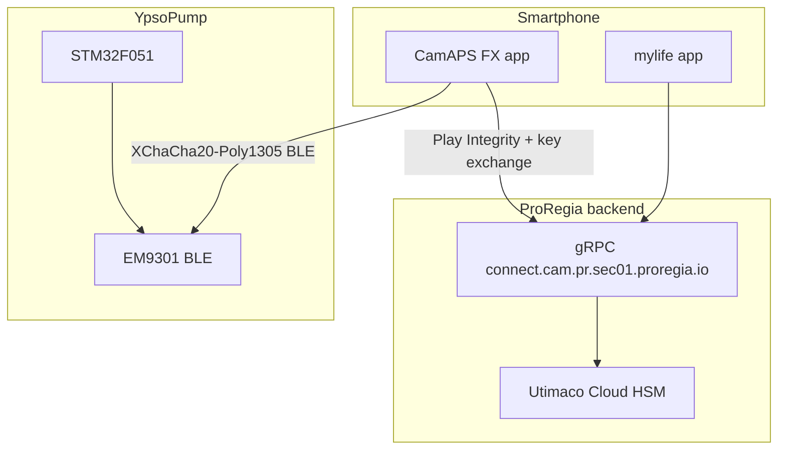

# YpsoPump Research

**Reverse engineering documentation and AndroidAPS driver for the Ypsomed YpsoPump insulin pump.**

> **#WeAreNotWaiting** — Because patients should not have to wait for interoperability.

**Browse the docs site:** [master3395.github.io/ypsopump-research](https://master3395.github.io/ypsopump-research/) (after GitHub Pages is enabled)

This repository is an **enhanced fork** of [SandraK82/ypsopump-research](https://github.com/SandraK82/ypsopump-research). See [ATTRIBUTION.md](ATTRIBUTION.md) and [CHANGELOG.md](CHANGELOG.md).

---

## What is this?

Community research on the **mylife YpsoPump** patch pump and its companion apps **CamAPS FX** and **mylife**. The goal is to document protocols and security properties so the diabetes community can build open-source drivers, especially for [AndroidAPS](https://github.com/nightscout/AndroidAPS).

**This repository does NOT contain decompiled source code.** Findings are documented from static analysis of publicly available APKs and related public materials.

### What's new in v2 (master3395 fork)

| Topic | Detail |
|-------|--------|
| **CamAPS 189 vs 192** | Full APK comparison: Dexcom G7, CamAPS Liberty, minSdk 33, Play Integrity 1.6 |
| **Liberty availability** | Server-side gating and rollout notes ([doc 21](docs/21-camaps-liberty-availability.md)) |
| **CGM error codes** | User-facing `LBR`/`DCI`/`DDC`/`DG7X` tables + CSV ([doc 22](docs/22-cgm-error-codes-reference.md)) |
| **Docs site** | Styled static site in [site/](site/), built with `npm run build-site` |

Upstream analysis primarily used CamAPS FX **v1.4(190).111**. This fork adds **v1.4(189).101** vs **v1.4(192).101** (mmol/L).

---

## Architecture at a glance



---

## Key findings

| Topic | Finding |
|-------|---------|
| **BLE encryption** | XChaCha20-Poly1305 AEAD via libsodium 1.0.20 |
| **Key exchange** | 9-step protocol involving app, backend (gRPC), and pump |
| **Key derivation** | Curve25519 ECDH + HChaCha20 KDF |
| **Commands** | 33 BLE commands (indices 0–32) across 4 services |
| **Backend** | `connect.cam.pr.sec01.proregia.io:443` — no certificate pinning (upstream finding) |
| **Key expiry** | 28-day expiry enforced app-side only; pump does not check |
| **Hardware** | STM32F051 (MCU) + EM9301 (BLE radio) |
| **Dexcom G7 in CamAPS** | Full stack in build **192** only ([doc 20](docs/20-camaps-apk-189-vs-192.md)) |
| **CamAPS Liberty (FCL)** | Code in **192**; visibility server-gated ([doc 21](docs/21-camaps-liberty-availability.md)) |
| **minSdk (192)** | Android 13+ (minSdk 33, was 31 in 189) |
| **Play Integrity (192)** | Client library 1.6.0 (was 1.3.0 in 189) |

---

## Documentation

### Pump hardware and BLE (01–04)

| Doc | Description |
|-----|-------------|
| [01 — Hardware](docs/01-hardware.md) | PCB, STM32F051, EM9301, FCC filings |
| [02 — BLE Protocol](docs/02-ble-protocol.md) | 33 commands, GATT UUIDs |
| [03 — Encryption](docs/03-encryption.md) | XChaCha20-Poly1305 stack |
| [04 — Key Exchange](docs/04-key-exchange.md) | 9-step protocol, 116-byte payload |

### Backend and security (05–10)

| Doc | Description |
|-----|-------------|
| [05 — Backend](docs/05-backend-communication.md) | gRPC, AWS, Azure, Firebase |
| [06 — Algorithm](docs/06-closed-loop-algorithm.md) | Encrypted native library |
| [07 — Obfuscation](docs/07-obfuscation.md) | DexGuard, class map |
| [08 — Security](docs/08-security-findings.md) | Vulnerabilities, attack surface |
| [09 — Bypass](docs/09-bypass-options.md) | Frida pump faking, key extraction |
| [10 — Legal](docs/10-legal-analysis.md) | Interoperability and research basis |

### CamAPS app analysis (11–13, 20–22)

| Doc | Description |
|-----|-------------|
| [11 — CamAPS Algorithm](docs/11-camaps-algorithm-analysis.md) | Cambridge MPC (build 190) |
| [12 — CamAPS Sideload](docs/12-camaps-sideload-bypass.md) | Sideload bypass attempt |
| [13 — Play Integrity](docs/13-play-integrity-bypass-success.md) | STRONG_INTEGRITY bypass notes |
| **[20 — APK 189 vs 192](docs/20-camaps-apk-189-vs-192.md)** | **G7, Liberty, platform diff (fork)** |
| **[21 — Liberty availability](docs/21-camaps-liberty-availability.md)** | **Market gating (fork)** |
| **[22 — CGM error codes](docs/22-cgm-error-codes-reference.md)** | **LBR/DCI/DDC/DG7X + CSV (fork)** |

### mylife app (14–19)

| Doc | Description |
|-----|-------------|
| [14 — Overview](docs/14-mylife-app-overview.md) | Xamarin/.NET stack |
| [15 — Security](docs/15-mylife-app-security.md) | Anti-tamper posture |
| [16 — Protocol](docs/16-mylife-app-proregia-protocol.md) | ProRegia gRPC |
| [17 — Components](docs/17-mylife-app-components.md) | Activities, Dexcom SDK |
| [18 — Bypass plan](docs/18-mylife-app-bypass-plan.md) | Rooted device plan |
| [19 — Key lifecycle](docs/19-key-lifecycle-pump-rotation.md) | Pump rotation, counters |

---

## Practical guides

| Guide | Description |
|-------|-------------|
| [Building a Driver App](guides/building-a-driver-app.md) | BLE, crypto, commands walkthrough |
| [Frida Key Extraction](guides/frida-key-extraction.md) | Shared key capture + pump faking |
| [BLE Sniffing Setup](guides/ble-sniffing-setup.md) | nRF Sniffer + Wireshark |

---

## AAPS driver

The [`aaps-driver/`](aaps-driver/) directory contains a work-in-progress AndroidAPS pump driver module:

- XChaCha20-Poly1305 encryption implementation
- Curve25519 key exchange (local steps)
- All 33 command codes
- PumpType.YPSOPUMP integration
- Status, bolus, and TBR command classes

**Status:** Structure is complete; BLE payload verification on real hardware and key-exchange bootstrap via Frida/CamAPS proxy are still required. See [Strategy A in doc 09](docs/09-bypass-options.md).

---

## Data files

| File | Rows | Description |
|------|------|-------------|
| [data/cgm-error-codes-192.csv](data/cgm-error-codes-192.csv) | 206 | User-facing CGM support codes (build 192) |
| [data/cgm-notification-enums-192.csv](data/cgm-notification-enums-192.csv) | 147 | Internal notification enums (build 192) |

---

## Build the documentation site

```bash
cd tools
npm install
npm run build-site
```

Output is written to `site/`. Commit `site/` and enable GitHub Pages with source **branch `main`**, folder **`/site`**.

---

## Responsible disclosure

Findings come from **static analysis of publicly available APKs**. No active exploitation of production systems is documented as performed by this fork's authors.

We recommend Ypsomed/CamDiab:

- Implement certificate pinning on gRPC and REST channels
- Enforce key expiration server-side
- Rotate hardcoded credentials

---

## Disclaimer

**THIS SOFTWARE IS PROVIDED FOR RESEARCH AND EDUCATIONAL PURPOSES ONLY.**

- This is NOT a medical device and is NOT approved for therapeutic use
- Do NOT use this to control insulin delivery without understanding the risks
- Incorrect insulin dosing can cause severe hypoglycemia or death
- Always have a fallback to the official CamAPS FX app
- The authors are not responsible for any harm resulting from use of this information

**If you choose to use this with a real insulin pump, you do so entirely at your own risk.**

---

## Credits

- [SandraK82/ypsopump-research](https://github.com/SandraK82/ypsopump-research) — original research and documentation
- [AndroidAPS](https://github.com/nightscout/AndroidAPS) — open-source AID system
- [OpenAPS](https://openaps.org/) — #WeAreNotWaiting
- [Nightscout](https://nightscout.github.io/) — open-source CGM in the cloud

## Contributing

Contributions welcome. High-value areas:

- Verifying BLE command payloads on real YpsoPump hardware
- Completing AAPS driver integration
- CamAPS build comparisons for versions after 192
- Per-command request/response documentation

## License

[MIT License](LICENSE)
